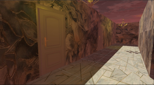
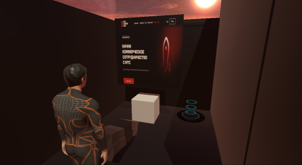
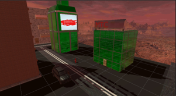
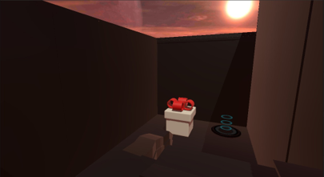
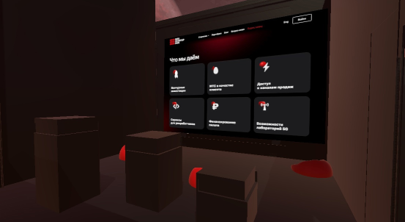
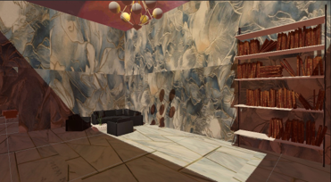
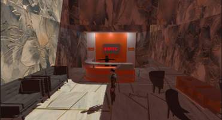

  <h1>Hackathon IT Space 2022 team "Coders".</h1>
  

  
	
	

  <h3>Information about the hackathon</h3>

<a>
The hackathon was held for high school and college students.
 
Hackathon Directions:

- *Cybersecurity*
   
  The direction is devoted to the basic concepts of this sphere. Participants will be able to familiarize themselves with the rules of protecting their personal data and passwords. Familiarity with cryptography will enable the use of encryption: we will learn what ciphers exist and how secure they are. And the skills of searching for web vulnerabilities will give an opportunity to try themselves in CTF.
  
- *VR*
   
  The course is dedicated to creating applications in virtual reality environment. Participants will be able to familiarize themselves with different application development environments, such as Varwin, VR Concept, Unity 3D, Unreal Engine applicable for solving different problems. Also mastering different environments will allow teams with different levels of knowledge and skills to participate.
  
- *Mobile Game Development*
   
  The direction is devoted to the creation of mobile applications using different development environments. MIT App Inventor - visual development environment for android applications only, requiring minimal programming knowledge from the user. Unity is a professional development environment for participants with already existing competencies in the chosen direction.

The direction *"Mobile Game Development "* was chosen by a voting team.
</a>

  <h3>Team composition and roles in the team</h3>

<a>
  
  *  ***Sukhorukov Kirill Andreyevich*** <a href="https://github.com/K1rsN7">***K1rsN7***</a> 
      * Captain
      * Developer
  * ***Alexander Vladimirovich Sokurov*** <a href="https://github.com/SOK08">***SOK08***</a> 
      * Level and map designer
  * ***Fedyakov Daniil Alexandrovich*** 
      * Level and map designer
  * ***Viktoria Solovieva Alexandrovna*** 
      * Artist
  * ***Mikhail Sergeyevich Belyaev*** 
      * Writer
</a>

  <h3>Progress of work</h3>

<a>
  
  1. Coming up with the concept of the game. 
  In the beginning of the journey, about half of the first day was spent coming up with a game concept. Many good ideas were proposed, but the problem was that we all lacked experience in application development and working with the Unity engine. In the course of heated discussions we decided to make a game in the style of a wandering game. We were able to realize the game in this style. 
  
  2. Assigning roles and getting to work. 
  Before starting the work it was necessary to assign responsibilities. Roles were assigned according to the experience and skills of the participants. Once the roles were assigned, the work began. This was the end of the first day. 
  
  3. Sketching sketches and the first prototype of the game. 
  The second, third, fourth, fifth days were fully devoted to the realization of the game. During this period there were a lot of changes in locations, start menu, mechanics, animations. Everyone had to study a lot of information and work with previously unknown technologies. A huge amount of work was done by designers and artist. By this time there was already a prototype of the game, but with a huge number of bugs. 
  The sixth and seventh day was a lot of fun for the developer. He had to put all the models, artist's and designers' work into one project. As a result, it worked out and the game functioned well. In the tests the game performed well and a team decision was made to stop with this option. During the last half of the seventh day the project was compiled for Android and a product presentation was made. After that, 2 hours before the end of the application process, the product was shipped. 
</a>

  <h3>The results</h3>

<a>
  As a result, our team lacked a few points to pass to the next stage. For us it was a good experience in game development on the Unity game engine. Taking into account the fact that all the participants had almost no experience in team development, we showed a decent result. 
</a>

  <h3>Certificate</h3> 
   
  <h3>Screenshots of the game</h3>
  
  
  
  
  
  
  

